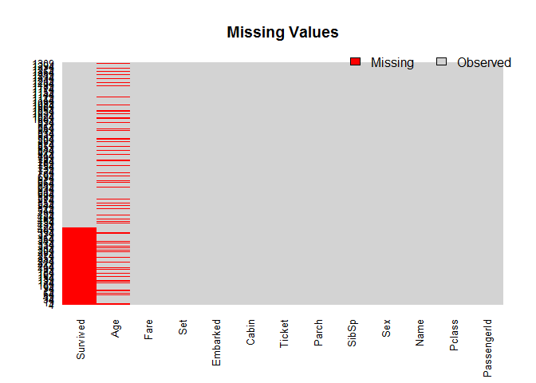
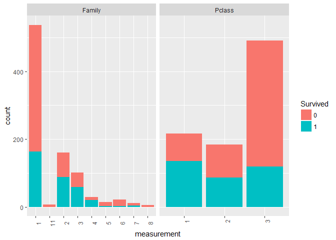
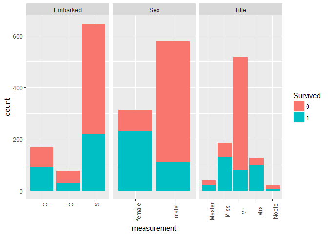
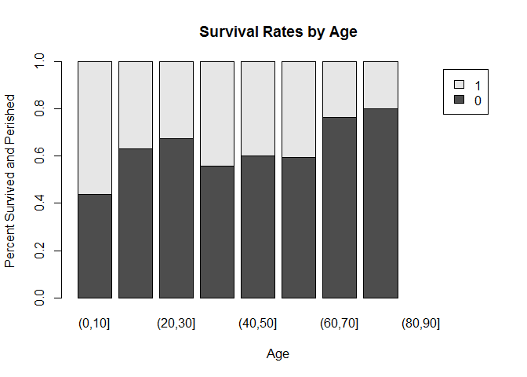
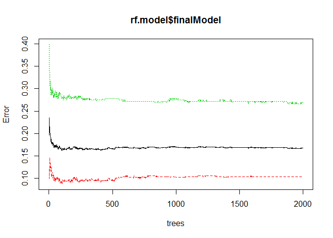
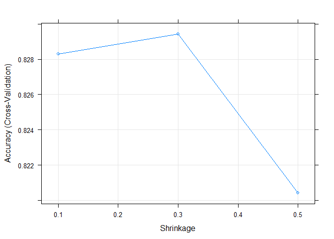
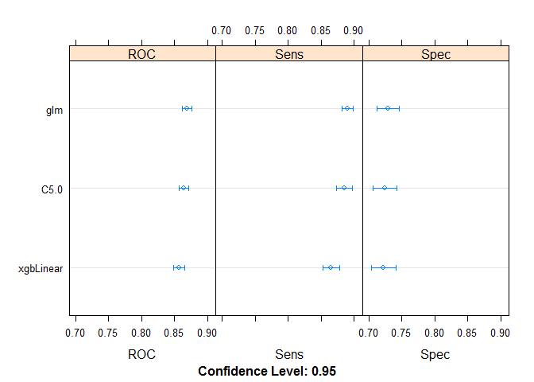
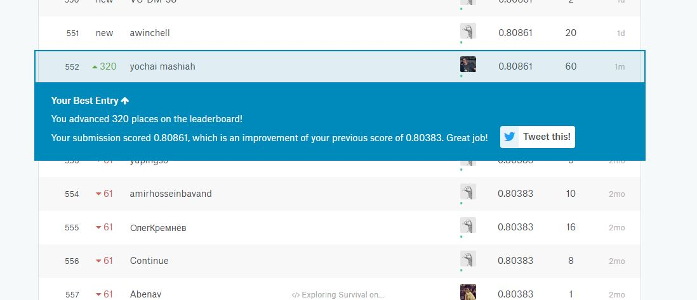

``` r
library(caret)
library(rpart)
library(pROC)
```

``` r
#set working directory
setwd('C:/Users/DELL/Desktop/study/year4/DataS')
```

Read the train.csv and test.csv files into a dataframes

``` r
train_set <- read.csv("Titanic/train.csv")
test_set <- read.csv("Titanic/test.csv")
train_set$Set <- "Train"
test_set$Set <- "Test"

test_set$Survived <- NA 
full_data <- rbind(train_set, test_set)
```

Data Understanding
==================

``` r
summary(full_data)
```

    ##   PassengerId      Survived          Pclass     
    ##  Min.   :   1   Min.   :0.0000   Min.   :1.000  
    ##  1st Qu.: 328   1st Qu.:0.0000   1st Qu.:2.000  
    ##  Median : 655   Median :0.0000   Median :3.000  
    ##  Mean   : 655   Mean   :0.3838   Mean   :2.295  
    ##  3rd Qu.: 982   3rd Qu.:1.0000   3rd Qu.:3.000  
    ##  Max.   :1309   Max.   :1.0000   Max.   :3.000  
    ##                 NA's   :418                     
    ##                                Name          Sex           Age       
    ##  Connolly, Miss. Kate            :   2   female:466   Min.   : 0.17  
    ##  Kelly, Mr. James                :   2   male  :843   1st Qu.:21.00  
    ##  Abbing, Mr. Anthony             :   1                Median :28.00  
    ##  Abbott, Mr. Rossmore Edward     :   1                Mean   :29.88  
    ##  Abbott, Mrs. Stanton (Rosa Hunt):   1                3rd Qu.:39.00  
    ##  Abelson, Mr. Samuel             :   1                Max.   :80.00  
    ##  (Other)                         :1301                NA's   :263    
    ##      SibSp            Parch            Ticket          Fare        
    ##  Min.   :0.0000   Min.   :0.000   CA. 2343:  11   Min.   :  0.000  
    ##  1st Qu.:0.0000   1st Qu.:0.000   1601    :   8   1st Qu.:  7.896  
    ##  Median :0.0000   Median :0.000   CA 2144 :   8   Median : 14.454  
    ##  Mean   :0.4989   Mean   :0.385   3101295 :   7   Mean   : 33.295  
    ##  3rd Qu.:1.0000   3rd Qu.:0.000   347077  :   7   3rd Qu.: 31.275  
    ##  Max.   :8.0000   Max.   :9.000   347082  :   7   Max.   :512.329  
    ##                                   (Other) :1261   NA's   :1        
    ##              Cabin      Embarked     Set           
    ##                 :1014    :  2    Length:1309       
    ##  C23 C25 C27    :   6   C:270    Class :character  
    ##  B57 B59 B63 B66:   5   Q:123    Mode  :character  
    ##  G6             :   5   S:914                      
    ##  B96 B98        :   4                              
    ##  C22 C26        :   4                              
    ##  (Other)        : 271

``` r
str(full_data)
```

    ## 'data.frame':    1309 obs. of  13 variables:
    ##  $ PassengerId: int  1 2 3 4 5 6 7 8 9 10 ...
    ##  $ Survived   : int  0 1 1 1 0 0 0 0 1 1 ...
    ##  $ Pclass     : int  3 1 3 1 3 3 1 3 3 2 ...
    ##  $ Name       : Factor w/ 1307 levels "Abbing, Mr. Anthony",..: 109 191 358 277 16 559 520 629 417 581 ...
    ##  $ Sex        : Factor w/ 2 levels "female","male": 2 1 1 1 2 2 2 2 1 1 ...
    ##  $ Age        : num  22 38 26 35 35 NA 54 2 27 14 ...
    ##  $ SibSp      : int  1 1 0 1 0 0 0 3 0 1 ...
    ##  $ Parch      : int  0 0 0 0 0 0 0 1 2 0 ...
    ##  $ Ticket     : Factor w/ 929 levels "110152","110413",..: 524 597 670 50 473 276 86 396 345 133 ...
    ##  $ Fare       : num  7.25 71.28 7.92 53.1 8.05 ...
    ##  $ Cabin      : Factor w/ 187 levels "","A10","A14",..: 1 83 1 57 1 1 131 1 1 1 ...
    ##  $ Embarked   : Factor w/ 4 levels "","C","Q","S": 4 2 4 4 4 3 4 4 4 2 ...
    ##  $ Set        : chr  "Train" "Train" "Train" "Train" ...

Data Preparetion
================

``` r
full_data$Name <- as.character(full_data$Name)
full_data$Cabin <- as.character(full_data$Cabin)
full_data$Ticket <- as.character(full_data$Ticket)
full_data$Survived <- as.factor(full_data$Survived)
```

Missing value
-------------

``` r
suppressMessages(library(Amelia))
```

    ## Warning: package 'Amelia' was built under R version 3.3.3

``` r
missmap(full_data, main = "Missing Values", col = c("red", "lightgrey"))
```



1.  For the missing fare value- median value of fare in Pclass 3 = $8.05
2.  For the 0 fare value- passengers fares using the median fare of the Pclass
3.  For the missing Embarked value- the majority of Embarked are “S”

``` r
#median value of fare in Pclass 3 = $8.05
full_data$Fare[which(is.na(full_data$Fare))] <- 8.05

#passengers fares using the median fare of the Pclass
full_data$Fare[which(full_data$Fare == 0)] <- ifelse(full_data$Pclass[which(full_data$Fare == 0)] == 1, 60.0, ifelse(full_data$Pclass[which(full_data$Fare == 0)] == 2, 15.0458, 8.05))

#the majority of Embarked are “S”
full_data$Embarked[c(62, 830)] <- "S"
```

Feature Engineering
===================

1.  Extract title from Name: Miss, Mrs...
2.  Family size: SibSp + Parch + 1
3.  Using a decision tree to estimate the missing ages
4.  Mother or not
5.  Child or Adult

``` r
#1.title
full_data$Title <- gsub('(.*, )|(\\..*)', '', full_data$Name)
full_data$Title <- as.character(full_data$Title)

full_data$Title[full_data$Title == 'Capt' | full_data$Title == 'Col' | full_data$Title == 'Don' | full_data$Title == 'Dona' | full_data$Title == 'Dr' | full_data$Title == 'Jonkheer' | full_data$Title == 'Lady' | full_data$Title == 'Major' | full_data$Title == 'Rev' | full_data$Title == 'Sir'] <- 'Noble'

full_data$Title[ full_data$Title == 'the Countess' | full_data$Title == 'Ms'] <- 'Mrs'

full_data$Title[ full_data$Title == 'Mlle' | full_data$Title == 'Mme'] <- 'Miss'

# change Title to factor
full_data$Title <- as.factor(full_data$Title) 
```

``` r
#2.family size
full_data$Family <- full_data$SibSp + full_data$Parch + 1
```

``` r
#3.estimate the missing ages
est_age <- rpart(Age ~ Pclass  + Sex + SibSp + Parch + Fare + Embarked + Title, 
                       data = full_data[!is.na(full_data$Age), ], method = "anova")
full_data$Age[is.na(full_data$Age)] <- predict(est_age, full_data[is.na(full_data$Age), ])
```

``` r
#4.Create the column child and indicate - child or adult
full_data$Child[full_data$Age < 18] <- 'Child'
full_data$Child[full_data$Age >= 18] <- 'Adult'
full_data$Child  <- factor(full_data$Child)
```

``` r
#5.Create the column  Mother and indicate - Not Mother or Mother
full_data$Mother <- 'Not Mother'
full_data$Mother[full_data$Sex == 'female' & full_data$Parch > 0 & full_data$Age > 18] <- 'Mother'
full_data$Mother <- factor(full_data$Mother)
```

Data Visualization
==================

``` r
#split data into train and test sets.
train_set <- full_data[which(full_data$Set == "Train"), ]
test_set <- full_data[which(full_data$Set == "Test"), ]
```

``` r
data_set1 <- data.frame(train_set[,c(2,3,15)])
data_set2 <- data.frame(train_set[,c(2,5,12,14)])

data_set1[,c(1:3)] <- lapply(data_set1, factor)
data_set2[,c(1:4)] <- lapply(data_set2, factor)

#install.packages("tidyr")
library(tidyr)
data1<- gather(data_set1, key = 'feature', value = 'measurement', -Survived)
data2<- gather(data_set2, key = 'feature', value = 'measurement', -Survived)

#install.packages("ggplot2")
library(ggplot2)
  
qplot(x=measurement,data=data1,fill=Survived) + facet_grid(~feature,scales="free")+ theme(axis.text.x = element_text(angle = 90))
```



``` r
qplot(x=measurement,data=data2,fill=Survived) + facet_grid(~feature,scales="free")+ theme(axis.text.x = element_text(angle = 90))
```



``` r
#age
Age.bins <- cut(train_set$Age, c(0, 10,20,30,40,50,60,70,80,90,100))
Age.prop <- prop.table(table(train_set$Survived, Age.bins),2)
barplot(Age.prop, main = "Survival Rates by Age", xlab = "Age", ylab = "Percent Survived and Perished", legend = row.names(Age.prop))
```



Modeling
========

We will use the following features to predict the class 'Survived':
Pclass, Sex, Age, SibSp, Parch, Family, Fare, Embarked, Title

Random Rorest
-------------

``` r
set.seed(421)
```

We use its “rf” method that is based on the “randomForest” package.
Train a rf model based on the train data.
Set the number of trees to 2000 (ntree).

``` r
rf.model <- train(Survived ~ Pclass + Sex + Age + SibSp + Parch + Family + Fare + Embarked + Title, data = train_set, method = "rf", ntree=2000, importance=TRUE)
```

``` r
plot(rf.model$finalModel)
```

 Explanation of the plot:
The red line show the error rate for ‘died’,
The green line show the error rate for ‘survived’,
The black line shows the overall error rate which falls below 20%.
We can see that we are more successful predicting death than we are survival.

Predict the target feature for records of the test set, using the trained model.

``` r
rf.test.ans <- predict(rf.model, newdata = test_set)
rf_submission <- data.frame(PassengerId = test_set$PassengerId, Survived = rf.test.ans)
write.csv(rf_submission, file = "submission_rf.csv", row.names = FALSE)
```

SVM with caret
--------------

Train the model using the caret package. Set up a 10-fold cross validation configuration.

``` r
library(e1071)

control <- trainControl(method="cv", number=10)
svm.model <- svm(factor(Survived) ~ Pclass + Sex + Age + SibSp + Parch + Family + Fare + Embarked + Title, data = train_set,  trControl=control)
```

``` r
# construct testing data frame

test_data_set <- data.frame(test_set[,c(3,5,6,7,8,15,10,12,14)])
```

Predict the target attribute for its records using your trained model.

``` r
# make prediction
svm_predict = predict(svm.model,newdata = test_data_set )
svm.test.ans = rep(NA,418)
for(i in 1:418){
  svm.test.ans[i] = as.integer(svm_predict[[i]]) - 1
}
```

``` r
# create a csv file for submittion
svm_submission <- data.frame(PassengerId = test_set$PassengerId, Survived = svm.test.ans)
write.csv(svm_submission, file = "submission_svm_caret.csv", row.names = FALSE)
```

eXtreme Gradient Boosting
-------------------------

XGB is a popular variant of the gradient boosting machine that adds mainly a regularization method, and parallel processing capabilities.

``` r
metric <- "Accuracy"
control <- trainControl(method="cv", number=5)

#First we need to set possible parameter’s values in the tunning grid.
grid <- expand.grid(.nrounds=20,.max_depth=6,.eta=c(0.1,0.3,0.5),.gamma=0.1,.colsample_bytree=0.5,.min_child_weight=0.01,.subsample=0.7)

#And then we are all set to run the train function, this time using the “xgbTree” method:
fit.xgb <- train(factor(Survived) ~ Pclass + Sex + Age + SibSp + Parch + Family + Fare + Embarked + Title, data = train_set, method="xgbTree", metric=metric, trControl=control, verbose=FALSE,tuneGrid =grid)
```

    ## Loading required package: xgboost

    ## Warning: package 'xgboost' was built under R version 3.3.3

    ## Loading required package: plyr

``` r
plot(fit.xgb)
```



``` r
# make prediction
pred_xgb= predict(fit.xgb,newdata=test_data_set)

# create a csv file for submittion
xgb_submission <- data.frame(PassengerId = test_set$PassengerId, Survived = pred_xgb)
write.csv(xgb_submission, file = "submission_xgb.csv", row.names = FALSE)
```

SVM model without caret
-----------------------

``` r
indices <- sample(1:nrow(train_set),nrow(train_set)*0.75)
train<- train_set[indices,]
test<- train_set[-indices,]

#Train a svm model based on the train data.
svm2.model <- svm(factor(Survived) ~ Pclass + Sex + Age + SibSp + Parch + Family + Fare + Embarked + Title, data = train)

#Predict the target feature for records of the test set, using the trained model.
pred= predict(svm2.model,data=test)

summary(pred)
```

    ##   0   1 
    ## 447 221

``` r
#Calculate the model’s test accuracy.
mean(pred==test$Survived)
```

    ## [1] 0.5329341

``` r
# make prediction
pred= predict(svm2.model,newdata=test_data_set)

# create a csv file for submittion
svm_submission <- data.frame(PassengerId = test_set$PassengerId, Survived = pred)
write.csv(svm_submission, file = "submission_svm.csv", row.names = FALSE)
```

Ensembles
---------

``` r
#install.packages("caretEnsemble")
library('caretEnsemble')
library('tidyr')
library('digest')
```

``` r
train_set$Survived<- as.factor(train_set$Survived)
levels(train_set$Survived)<-c("x0","x1")

n=c('Survived', 'Pclass' , 'Sex' , 'Age' , 'SibSp' , 'Parch' 
                 , 'Family' , 'Fare' , 'Embarked' , 'Title' )
d=data.frame(train_set[,n])
```

trainControl
------------

1.  classProbs = TRUE indicates that class probabilities should be computed for classification models
2.  summaryFunction=twoClassSummary sets a summary function that computes sensitivity, specificity and the area under the ROC curve
3.  savePredictions = “final” saves the predictions for the optimal tuning parameters
4.  method="cv" using 25 fold cross validation

``` r
my_control <- trainControl(
  method="cv",
  number=25,
  savePredictions="final",
  classProbs=TRUE,
  index=createResample(d$Survived, 25),
  summaryFunction=twoClassSummary
)
```

caretList
---------

1.  running several models together, with the caretList method
2.  train a model based on the formula: Survived ~ .
3.  combine three models:glm, C5.0, xgbLinear

``` r
model_list_big <- caretList(
  Survived~., data=d,
  trControl=my_control,
  metric="ROC",
  methodList=c("glm","C5.0","xgbLinear")
 
)
```

Check the resaults

``` r
results <- resamples(model_list_big)
summary(results)
```

    ## 
    ## Call:
    ## summary.resamples(object = results)
    ## 
    ## Models: glm, C5.0, xgbLinear 
    ## Number of resamples: 25 
    ## 
    ## ROC 
    ##             Min. 1st Qu. Median   Mean 3rd Qu.   Max. NA's
    ## glm       0.8276  0.8581 0.8701 0.8689  0.8849 0.8944    0
    ## C5.0      0.8223  0.8527 0.8683 0.8641  0.8752 0.8858    0
    ## xgbLinear 0.8247  0.8416 0.8598 0.8571  0.8728 0.8855    0
    ## 
    ## Sens 
    ##             Min. 1st Qu. Median   Mean 3rd Qu.   Max. NA's
    ## glm       0.8541  0.8743 0.8923 0.8899  0.8978 0.9267    0
    ## C5.0      0.7906  0.8710 0.8818 0.8849  0.9015 0.9415    0
    ## xgbLinear 0.7749  0.8486 0.8615 0.8649  0.8889 0.9149    0
    ## 
    ## Spec 
    ##             Min. 1st Qu. Median   Mean 3rd Qu.   Max. NA's
    ## glm       0.6186  0.7091 0.7328 0.7295  0.7541 0.8051    0
    ## C5.0      0.6271  0.6970 0.7273 0.7244  0.7518 0.7967    0
    ## xgbLinear 0.6270  0.7043 0.7177 0.7224  0.7395 0.8062    0

``` r
dotplot(results)
```



Make sure that there is low correlation between them

``` r
# correlation between results
modelCor(results)
```

    ##                 glm      C5.0 xgbLinear
    ## glm       1.0000000 0.8173236 0.6355460
    ## C5.0      0.8173236 1.0000000 0.7455781
    ## xgbLinear 0.6355460 0.7455781 1.0000000

Stack our models together using a linear greedy optimization on AUC (metric=“ROC”) using caretEnsemble:

``` r
# caretEnsemble
greedy_ensemble <- caretEnsemble(
  model_list_big, 
  metric="ROC",
  trControl=trainControl(
    number=3,
    summaryFunction=twoClassSummary,
    classProbs=TRUE
  ))
summary(greedy_ensemble)
```

    ## The following models were ensembled: glm, C5.0, xgbLinear 
    ## They were weighted: 
    ## 2.8281 -3.1703 -1.3488 -1.0617
    ## The resulting ROC is: 0.8735
    ## The fit for each individual model on the ROC is: 
    ##     method       ROC      ROCSD
    ##        glm 0.8689437 0.01780560
    ##       C5.0 0.8640895 0.01668861
    ##  xgbLinear 0.8571199 0.01965767

Using caretStack, stack using a random forest

``` r
# caretStack
rf_ensemble <- caretStack(
  model_list_big,
  method='rf',
  metric="ROC",
  trControl=trainControl(
    number=3,
    summaryFunction=twoClassSummary,
    classProbs=TRUE
  ))
```

    ## note: only 2 unique complexity parameters in default grid. Truncating the grid to 2 .

Predict the target attribute, use greedy\_ensemble and rf\_ensemble

``` r
p0 <- predict(greedy_ensemble, test_set)
p1 <- predict(rf_ensemble, test_set)

levels(p0)<-c(0,1)
levels(p1)<-c(0,1)

solution <- data.frame(PassengerID = test_set$PassengerId, Survived = p0)
write.csv(solution, file = 'submission_ge.csv', row.names = F)
solution <- data.frame(PassengerID = test_set$PassengerId, Survived = p1)
write.csv(solution, file = 'submission_rfcs.csv', row.names = F)
```

Results:
========

score of rf.model- 0.80861 [a relative link](https://github.com/yochaimashiah/hw2/blob/master/results/submission_rf.csv)

score of svm.model without caret- 0.79426 [a relative link](https://github.com/yochaimashiah/hw2/blob/master/results/submission_svm.csv)

score of svm.model with caret- 0.79426 [a relative link](https://github.com/yochaimashiah/hw2/blob/master/results/submission_svm_caret.csv)

score of rf\_ensemble- 0.78947 [a relative link](https://github.com/yochaimashiah/hw2/blob/master/results/submission_rfcs.csv)

score of greedy\_ensemble- 0.77990 [a relative link](https://github.com/yochaimashiah/hw2/blob/master/results/submission_ge.csv)

score of xgb model- 0.72727 [a relative link](https://github.com/yochaimashiah/hw2/blob/master/results/submission_xgb.csv)

Location in Leaderboard- 552
----------------------------


